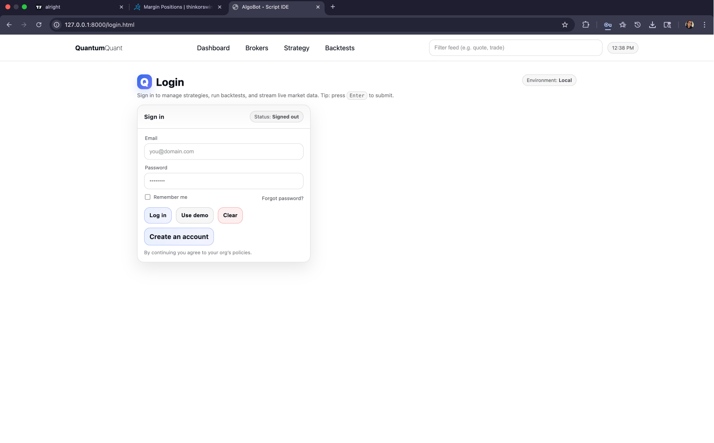
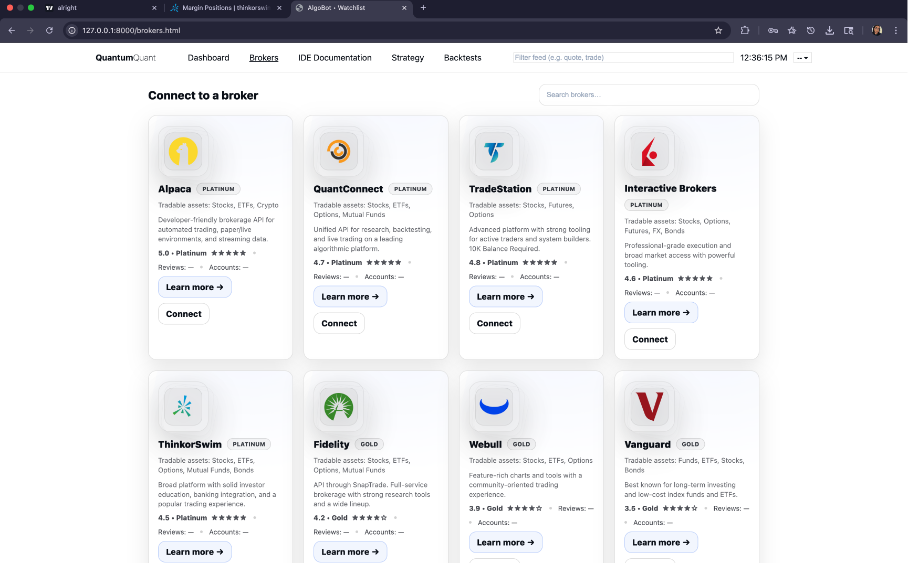
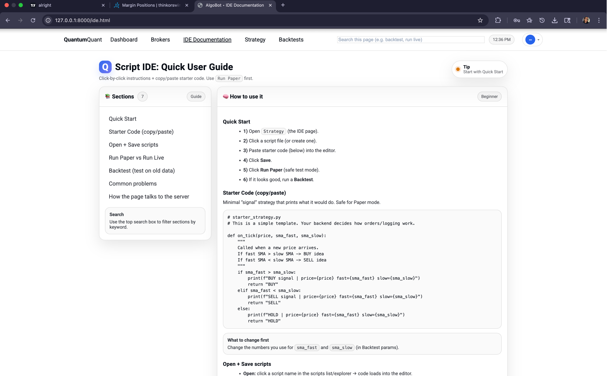

# MarketMonitor

<!-- Image carousel / gallery (README-friendly) -->
<p align="center">
  <a href="images/ui/index-01.png"></a>
</p>

A real-time market monitor that streams **1-minute bars + live quotes** from Alpaca, aggregates them into **CLOSED 5m / 15m / 30m / 1h bars**, computes technical features **only on closed bars**, and runs an **eligibility / session-state engine** (VWAP + candle direction + chop detection) to determine which symbols are *trade-worthy* as the session develops.

It also labels a **market regime** (**TREND/RANGE × HIGH/LOW volatility**) from **1h closed bars** for a selected benchmark symbol.

> ⚙️ **Trading Style Note**  
> The engine is **designed primarily for swing trading** (multi-hour to multi-day positioning), but the architecture is **fully adaptable**:
> - Timeframe gates can be adjusted (e.g. scalping with 1m/3m/5m)
> - VWAP and regime logic can be swapped or extended
> - Risk and sizing modules can be tuned per strategy  
>  
> The system intentionally separates **signal qualification** from **execution**, making it flexible across trading styles.

---

## System Overview

The system consists of:

- **Backend engine (`monitor.py`)** → streams data and writes CSV state files  
- **FastAPI server** → serves API endpoints and static UI  
- **Web UI dashboard** → real-time visualization of session state (read-only)

---

## What the Script Does

### 1) Streams Alpaca data
- **1m bars** (used to build higher timeframes)
- **Quotes** (context-only: bid / ask / mid / spread)

---

### 2) Aggregates bars (IMPORTANT: closed bars only)

A `BarAggregator` converts incoming **1m bars** into:

- 5m bars  
- 15m bars  
- 30m bars  
- 1h bars  

✅ **Only CLOSED candles are emitted. No partial bars are ever used.**

---

### 3) Computes technical features

For each timeframe and symbol, `RollingSeries` computes:

- `ret_1` (close-to-close return)
- `ema_20`, `ema_50`
- `rsi_14`
- `atr_14`, `atrp_14`
- `adx_14`
- `vwap` (intraday reset)
- `vwap_dist_pct`
- `vol_z_20`

---

### 4) Eligibility / Session-State Engine

On each **closed bar**, symbols move through a deterministic state machine.

#### Timeframe gates
- **5m close** → early filters, VWAP extremes, chop detection  
- **15m close** → directional bias (`LONG_ONLY / SHORT_ONLY / BOTH`)  
- **30m close** → confirmation vs reconsideration  
- **1h close** → sizing + risk multiplier adjustment  

#### States
- `ACTIVE`
- `SUSPENDED`
- `RECONSIDER`
- `CONFIRMED`

---

### 5) Market Regime Labeling (1h only)

For `REGIME_SYMBOL`:

- `ADX ≥ 22` → `TREND`, else `RANGE`
- `ATRP ≥ 0.60%` → `HIGH_VOL`, else `LOW_VOL`

---

## Output / Data Layout

All outputs are **append-only CSVs** under `OUT_DIR` (default: `./data_store`).

### `session_state_YYYYMMDD.csv`
Written on every **5m / 15m / 30m** state update.

Includes:
- `state`, `score`, `bias`, `flip_count`
- VWAP distances per timeframe
- `allow_trend`, `allow_mean_reversion`
- `sizing_mult`, computed `risk_mult`
- `reason`
- Quote snapshot fields (`bid / ask / mid / spread`)

---

## 🌐 Web UI (Dashboard)

<details>
  <p align="center">
  <a href="images/ui/login-00.png"></a>
  <a href="images/ui/brokers-03.png"></a>
    <a href="images/ui/documentation-04.png"></a>
  </p>
</details>

The UI is a **real-time visualization** of the CSV outputs with in-browser strategy scripting, one-click broker connections, backtesting engine and more.

### Serving the UI

```bash
uvicorn server:app --reload --port 8000
